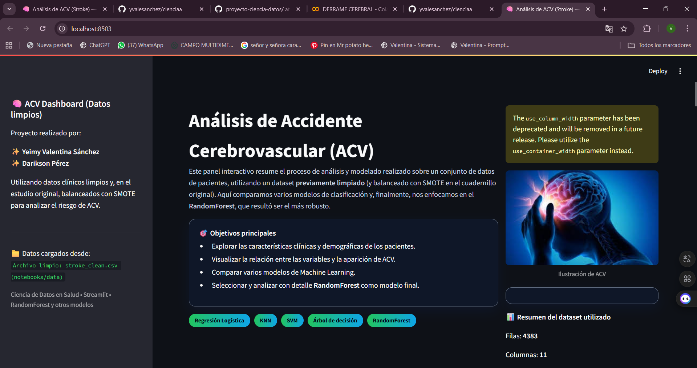
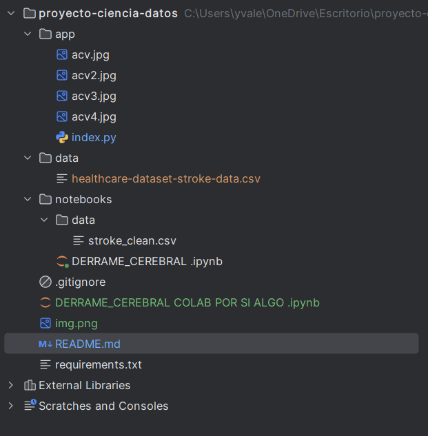
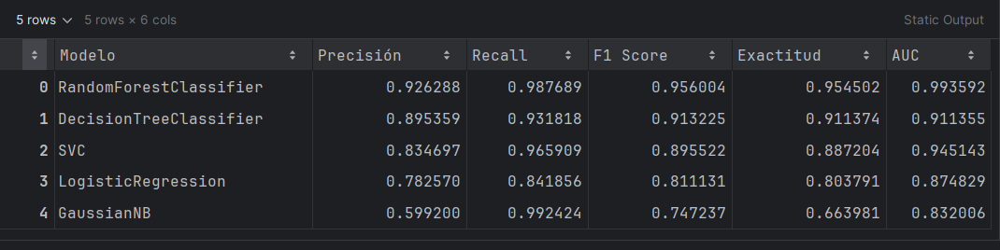
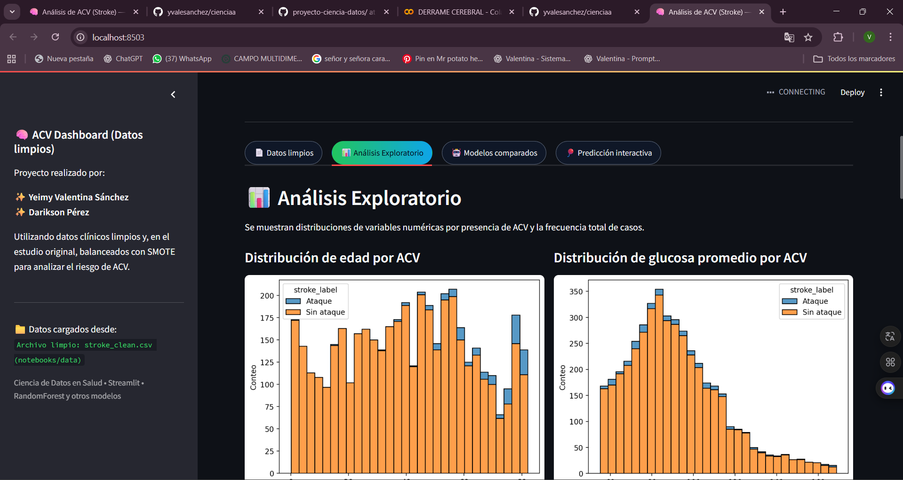
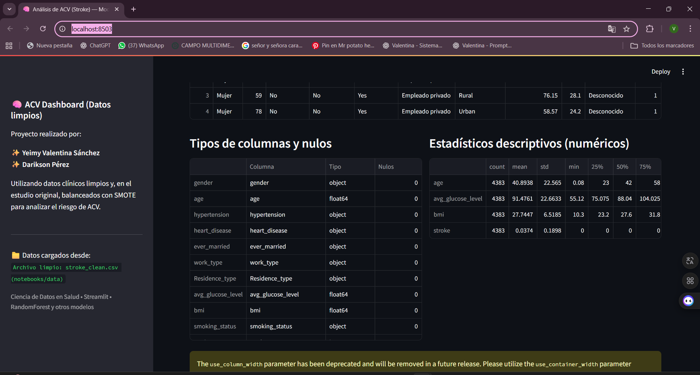
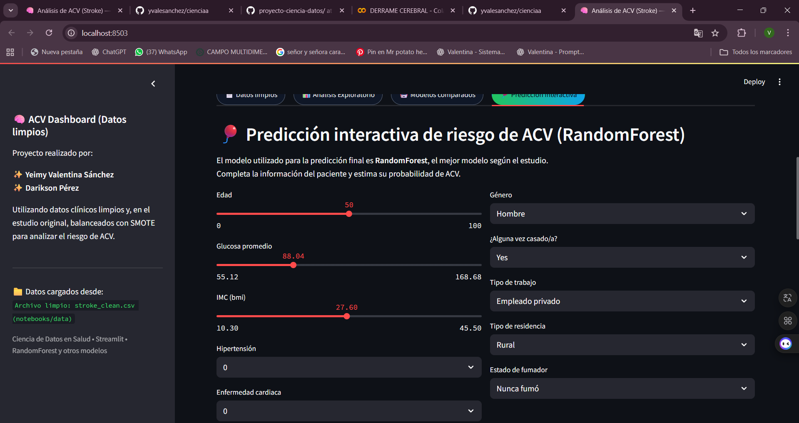

# proyecto-ciencia-datos
# Proyecto de Ciencia de Datos  
## Predicción de Accidente Cerebrovascular (ACV) mediante Machine Learning

Este proyecto desarrolla un flujo completo de análisis y modelado para predecir la probabilidad de que un paciente sufra un Accidente Cerebrovascular (ACV).  
Se incluye: limpieza del dataset, análisis exploratorio, balanceo de clases, comparación de modelos y una aplicación interactiva en Streamlit.

---

## Autores

- Yeimy Valentina Sánchez  
- Darikson Pérez  
---

**Nota:**
Por precaución, en la carpeta *notebooks/* se incluye también una copia adicional del cuaderno usado en Google Colab. Este archivo sirve como respaldo del análisis, la limpieza del dataset y el proceso completo de modelado en caso de que se requiera revisar o reproducir el flujo de trabajo original.

---

# 1. Estructura del Proyecto

---

# 2. Objetivo del Proyecto

El objetivo principal es identificar factores de riesgo asociados al ACV y construir un modelo predictivo capaz de estimar, con precisión, la probabilidad de que un paciente lo sufra.  
Para ello se implementa un proceso completo de ciencia de datos:

- Limpieza del dataset
- Análisis estadístico y visual
- Balanceo de clases con SMOTE
- Comparación de múltiples algoritmos
- Entrenamiento del mejor modelo (Random Forest)
- Desarrollo de un dashboard interactivo

---

# 3. Dataset Utilizado

Archivo original:  
data/healthcare-dataset-stroke-data.cs 

### 3.1. Tamaño y características
- Registros originales: 5110  
- Variables clínicas (edad, glucosa, IMC, hipertensión, tabaquismo, etc.)  
- Variable objetivo: **stroke** (0 = no, 1 = sí)

### 3.2. Proceso de limpieza (notebook)
En el cuaderno `DERRAME_CEREBRAL.ipynb` se realizaron:

1. Eliminación de duplicados  
2. Conversión de tipos numéricos  
3. Eliminación de valores atípicos en BMI y glucosa  
4. Imputación de valores faltantes  
5. Estandarización de variables  
6. Balanceo con SMOTE  

### 3.3. Dataset limpio final
El dataset procesado se guarda como:
notebooks/data/stroke_clean.csv

Este dataset es el que utiliza la aplicación Streamlit.

---

# 4. Análisis Exploratorio de Datos (EDA)

En el EDA se exploraron:

- Distribución de variables numéricas  
- Diagnóstico de valores atípicos  
- Relación entre variables clínicas y presencia de ACV  
- Comparaciones con boxplots  
- Correlaciones y patrones relevantes  

# 5. Modelos de Machine Learning Probados

Se entrenaron y compararon los siguientes modelos:

- Regresión Logística  
- KNN  
- Árbol de Decisión  
- Random Forest  
- SVM  
- Naive Bayes  
- (Opcional) XGBoost  

### Métricas comparadas:

- Accuracy  
- F1-Score  
- Matriz de confusión  
- ROC-AUC  

### 5.1. Mejor modelo
El algoritmo con mejor rendimiento fue:

**Random Forest**

Se selecciona como modelo final para predicciones debido a:

- Mejor AUC  
- Mejor equilibrio entre sensibilidad y precisión  
- Robustez frente a datos balanceados con SMOTE  

# 6. Aplicación Interactiva (Streamlit)

El archivo principal de la aplicación es:
app/index.py 

La aplicación incluye:

1. Portada descriptiva del proyecto  
2. Presentación del dataset limpio  
3. Gráficos del análisis exploratorio  
4. Entrenamiento en vivo del Random Forest  
5. Predicción interactiva ingresando características del paciente  
6. Probabilidad estimada de sufrir ACV  

# 7. Instalación y Ejecución

### 7.1. Instalación de dependencias
En la raíz del proyecto:

pip install -r requirements.txt

### 7.2. Ejecución del dashboard
Ejecutar:

streamlit run app/index.py

La aplicación se abrirá automáticamente en:

http://localhost:8501

---

# 8. Archivos Importantes

- `DERRAME_CEREBRAL.ipynb`: análisis completo, limpieza y SMOTE  
- `stroke_clean.csv`: dataset final utilizado en Streamlit  
- `index.py`: código del dashboard  
- `requirements.txt`: dependencias necesarias  

---

# 9. Conclusiones

- El dataset original requería una limpieza profunda para producir modelos confiables.  
- El desbalance severo de la variable objetivo fue resuelto mediante SMOTE.  
- Se evaluaron múltiples algoritmos; Random Forest presentó el mejor desempeño.  
- La aplicación permite explorar datos, visualizar gráficos y realizar predicciones con el modelo entrenado.  
- El proyecto integra correctamente todo el flujo de ciencia de datos: desde el EDA hasta la implementación interactiva.

---

# 10. Notas Finales

Este proyecto fue desarrollado con fines educativos para el curso de Ciencia de Datos.  
La herramienta final permite analizar factores de riesgo y explorar modelos predictivos aplicados al ámbito de la salud.

